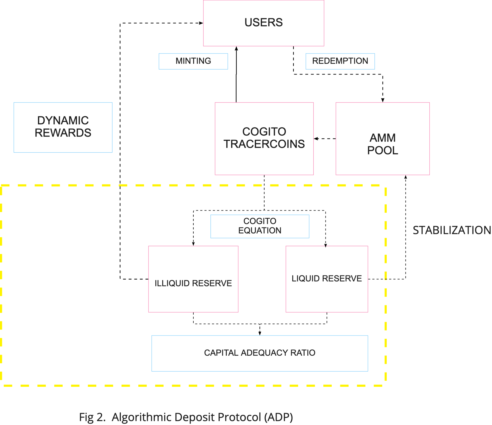

# ADP and Reserve Management

The Algorithmic Deposit Protocol (ADP) is created with the ultimate goal of providing passive income to users whose interest is aligned with the long-term vision of the project. This reward is represented by an annual percentage yield (APY) in the form of both stablecoins and CGV tokens (figure 2). The reward is achieved by diversifying the illiquid reserve into different investment options with varying risks and volatility, e.g. deposit pools, proof-of-stake rewards, business-to-business lending, yield farming pools, and direct investment in volatile assets, in order to generate realistic and sustainable returns. The rate depends on the tenors deposited into the ADP and long-term deposits are incentivized with higher yields, in a non-linear manner.

## Cogito equations

The swapping between two reserves that lie at the core of the protocol is based on the fractional ratio that the project is running at the given time $$t$$ , as defined by the following equations:

$$
x+y=A*(1-c)
$$

$$
\sum\nolimits_{i=1}^n  y_idf_i=A*(1-c)*CAR
$$

where:

$$A$$: user deposits, measured in USDC.

$$c$$: transaction cost in percentage.

$$x$$: liquid reserve, where $$x>=0$$.

$$y$$: illiquid reserve to be allocated to n different risky assets, we have $$y_i = \sum\nolimits_{i=1}^n y_i ∧ y_i​≥0$$.

$$df_i$$: discounting factor of risky asset $$y_i$$.

These equations provide a guiding framework for reserve allocations. Ultimately, other factors will need to be taken into account, such as market sentiment and liquidity, to maximize the returns from the investment.

## Example

As an illustration, assume Cogito is running at a minimum of 90% CAR. Alice deposits 101 USDC to mint the tracercoin, and the minting fee is 1%, i.e. 100 USDC will go to the reserve after subtracting the transaction fees. The liquid reserve consists of USDC and the illiquid reserve consists of 2 risky assets: a 6-month USDC deposit with a discounting factor of 95%, and BTC with 60%.

Solving the equations 2.1 and 2.2, we know that for the 101 USDC deposited, the algorithms are allowed to allocate anywhere between 14.3 to 25 USDC to BTC (detailed calculations are available in our github, and we will skip here for simplicity). Considering that the cryptocurrency market has an apparent cycle where it grows and retracts, which significantly impacts users' appetite for holding low-volatility coins, this range allows the protocol to have more flexibility to adjust investment strategies. In a rising market, the project can be more risky and invest in riskier assets, and therefore can allocate all 25 USDC to BTC; in a sluggish market the protocol is more likely to be risk-off and hold less risky assets, and only likely to invest 14.3 USDC in BTC.

## Investment risk management

When it comes to reserve investment, there is always a non-zero chance of counterparty risk - DeFi protocols could be hacked or exploited and cause loss of funds; CeFi protocols could be insolvent and pause user withdrawals, or worse, the platform is fraudulent and steals user funds. The treasury investment board, which can be formed and governed by the DAO, will build a risk rating system, assess and recommend a risk classification for the platform, and we will invest our illiquid reserve according to the risk guidance of such platforms.

In our work on the Cogito protocol, we have modeled the quality of platforms with the concept of probability of default. While there is no readily available data regarding the probability of default for DeFi and CeFi platforms, we take reference from Moody’s ratings where they classify entities as investment grade and speculative grade. Cogito Protocol will always invest in projects with manageable levels of risk that are at least comparable to a Moody’s ‘B’ rating. The investment board will be responsible to identify the partners and assess the associated risks, and the list of these partners will be updated in real time in the protocol. Another assumption we make is that since crypto is still a relatively immature industry, we should expect to see gradual improvements in credit quality over time.

## Single Investment Limit

One of the core principles of risk management is called the Single Investment Limit (SIL), which concerns the allocation of investments to low risk, medium risk and high risk platforms, subject to the governing CAR ratio. For example, if 95% < CAR < 110% , the allocation to high risk protocols should not exceed 8% individually and 20% collectively; the allocation to medium risk protocols should not exceed 20% individually and 50% collectively; and, the allocation to low risk protocols should not exceed 40% individually.

We apply these key assumptions in our financial modeling to simulate the possible outcomes of our investments in all market conditions, and the result supports the theory that is outlined here (refer to financial modeling for more details).
