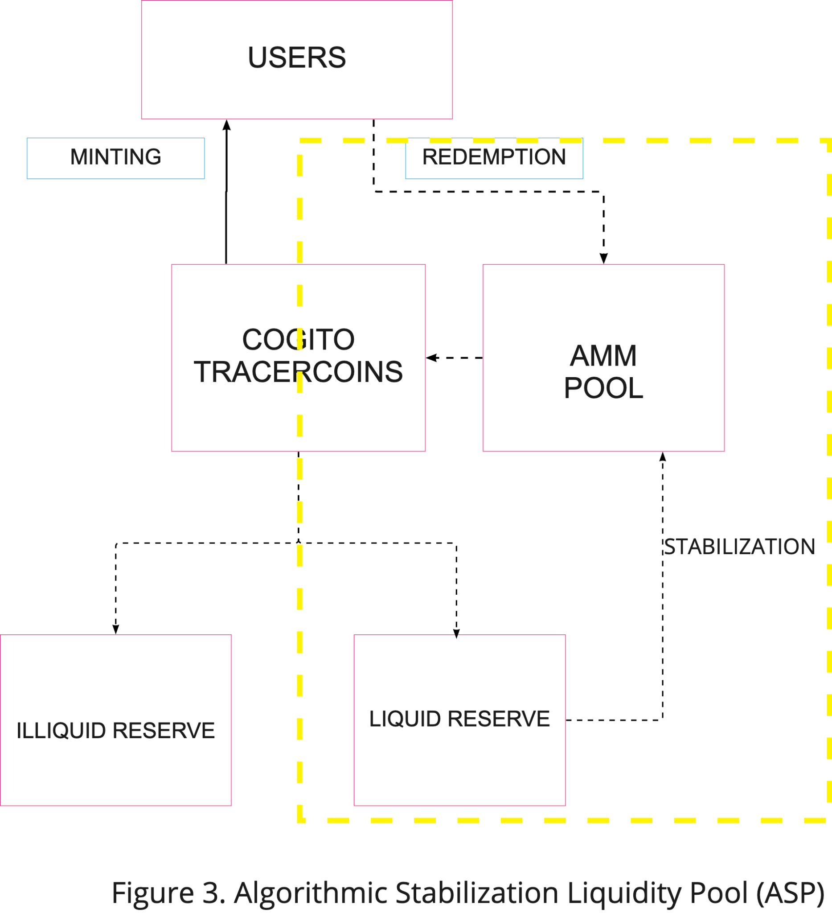

# ASP and Open Market Operations

The Algorithmic Stability Protocol (ASP) is created with the primary goal of stabilizing the system (figure 3). Initially, liquidity for the tracercoins will be provided in the form of a tracercoin/stablecoin pair on a Uniswap v2 AMM, which is the dominant AMM for DEXs in crypto currently. This allows the ASP to leverage the liquid reserve to rebalance the pool on a regular basis to support the price range.

As mentioned above, the ASF regulates the capital level, the allocation between liquid and illiquid assets, and the yield provided to users, in order to ensure that the price of the tracercoins is within expected boundaries. The “invisible hand of the market” should be helping to stabilize the system by taking advantage of arbitrage from price disparities. If the market price is above the price target, an arbitrage opportunity exists to mint new tokens into the system and sell on the open market. On the other hand, if the market price is below the boundaries, there is an arbitrage opportunity to purchase on the open market for a discount and sell it to the ASP.

In the case where the market fails to work, the Cogito algorithm will come into play. The following describes the behavior of the algorithm during expansion and contraction periods.

Expansion: when the market price is above the price upper bound, this indicates more demand than supply. Based on the trading boundaries limits and the prevailing CAR, the protocol automatically increases the number of tokens in circulation, sells on the AMM curve, and gradually brings the price down to its target. This can be thought of as de-collateralization.

Contraction: If the market price goes under the lower bound, this indicates more supply than demand. The protocol utilizes the liquid reserve to purchase the tracercoins on the AMM curve, decreasing the number of tokens circulating and gradually bringing the price back up to its target. This has the effect of increasing collateralization.

However, suppose this automatic mechanism does not happen for some reason. In this case, the algorithm starts to take further actions to redeem tokens and decrease circulating supply. Parameters such as transaction costs, redemption fees, floating yield, and staking rewards may be adjusted. This will incentivize users to hold or sell back tokens to burn. Opportunities for open market operations can also be considered by using CGV tokens to buy back tracercoins.

Such a mechanism supports tracercoins’ price while additionally benefiting from arbitrage and trading fees, generating value for the protocol and its stakeholders.
