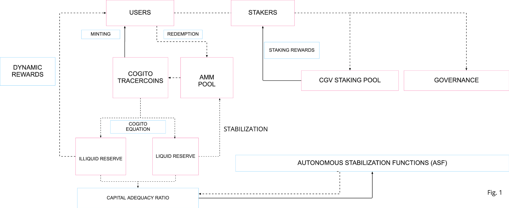
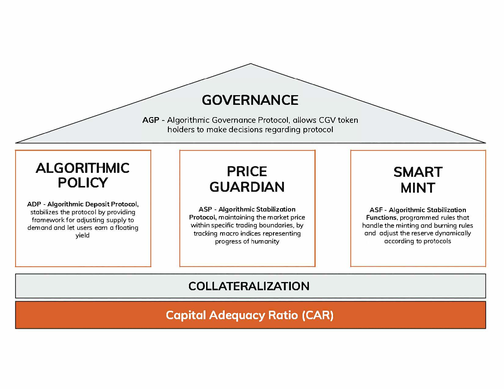
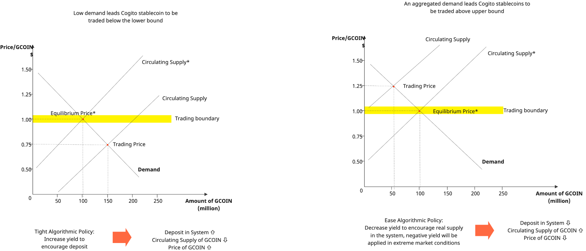

# Design

Initially the protocol will only accept stable assets as the reserve, but once the protocol gains traction and the system's money velocity increases, the underlying financial dynamics will gain more subtle mechanics. In this phase, the protocol will allow the reserve to accept a cautious portion of more volatile cryptocurrencies, and the capital adequacy ratio (CAR as defined in COGITO EQUATIONS) will change algorithmically to handle volatility or more exponential expansion (Fig. 1).

## CGV governance token

The CGV governance token will play a key role in regulating the use of these mechanisms, providing a tool for democratic decision-making and for rewards for users, and will also serve as a critical stabilization mechanism of the ecosystem. CGV and the initial tracercoins will be implemented on Cardano as native assets (and likely later ported to the Hypercycle sidechain), but can also be extended to other blockchains with bridges, enabling Cogito to interoperate with all DeFi protocols no matter what underlying blockchain they run on.

## Three main protocols

To guide the operation of its tracercoins, and under the supervision of the community of CGV holders, Cogito will operate three main protocols from the start:

**I) Algorithmic Deposit Protocol (ADP);**

**II) Algorithmic Stabilization Protocol (ASP); and**

**III) Algorithmic Governance Protocol (AGP).**

All these products will be regulated by a treasury reserve, which is formed by a liquid and illiquid component managed through Autonomous Stabilization Functions (ASFs) – programmed rules that adjust the risk-weighted reserve dynamically and handle the minting and burning rules and other stabilization mechanisms.

**Algorithmic Deposit Protocol (ADP)**

The goal of the ADP is to let users with different risk appetites deposit their tracercoins with customizable tenors to earn a floating yield, generated from the illiquid reserve that is managed by the treasury. This yield will be distributed both in CGV tokens and stablecoins.

The floating yield is acting as an instrument of algorithmic policy to help stabilize the system. In the case where there is a shortfall of tracercoin supply in the market, the yield will be reduced in order to discourage deposits, thereby increasing the circulating supply. Similarly, when there is too much supply, the protocol will increase the yield and therefore decrease the circulating supply. AI methods can be used here to predict undersupply or oversupply in advance, such that these situations can be counteracted before they get out of hand and require more effort.

**Algorithmic Stabilization Protocol (ASP)**

The ASP has the critical goal of maintaining the market price of the tracercoins within specific trading boundaries of their respective indices. The algorithmic stabilization functions will adjust the Capital Adequacy Ratio to ensure stability.

Initially, ASP will use Uniswap V2 functions to develop the liquidity pool. This effectively creates an open market that allows tracercoins to be exchanged efficiently. Using this module, we can leverage SingularityNet’s and SingularityDAO’s powerful trading desks and unique autonomous AI-driven agents to perform price arbitrage in order to maintain the stability of the tracercoins at all times.

The capital that the protocol can utilize and deploy comes from three sources: liquid reserves, loans collateralized by illiquid reserves, and proceeds from selling CGV tokens under extreme market conditions.

- Liquid reserves. A healthy portion of the reserve is kept as liquid assets, which is primarily stablecoins such as USDC, DAI etc.
- Loans collateralized by illiquid reserves. The illiquid component of the reserve is kept as low-to-medium risk assets, either in the form of investment into a basket of cryptocurrencies (e.g. BTC, ADA) or liquidity provided to other protocols for yield optimization. We will obtain a credit line by collateralizing the assets with the lender to supplement the liquidity, and subsequently the future protocol revenue will be prioritized to repay the debt
- Proceeds from selling CGV tokens. CGV acts as a last resort to absorb the price volatility of tracercoins. A predetermined percentage of CGV from the foundation is set aside to supplement the treasury reserve as an additional buffer to the system.

**Algorithmic Governance Protocol (AGP)**

The final protocol concerns CGV tokens. As with many other protocols, the intrinsic value of the Cogito governance token is positively correlated with tracercoin adoption. If the ecosystem grows and tracercoins are in high demand with a healthy CAR, some percentage of the illiquid reserve can be used to buy back CGV tokens, which aligns incentives among both CGV users and tracercoin users.

Usage of tracercoins will generate revenue for the protocol in three ways: minting fees of tracercoins, DEX arbitrage, and management fees from treasury management. CGV token holders will be able to stake their tokens to earn yield from the staking pool, together with a small percentage of inflationary reward. The revenue can also be used to buy back the CGV to decrease the circulation supply and therefore increase the token's value. This creates a positive benefit for Cogito because as the value of CGV goes up, tracercoins are more able to withstand extreme volatility events.

Finally, the protocol aims to implement the well-known "vote-escrowed model" to create an incentive-aligned decentralized autonomous organization (DAO). It prevents large users with a low long-term conviction from having a disproportionate amount of voting power, as compared to smaller users with a higher degree of confidence in the project. Such a voting system helps to align the interests of users with the long-term development of the protocol.
